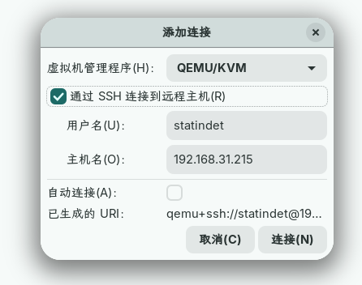
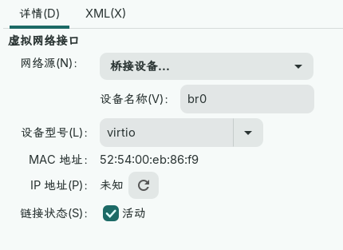

### 最小化安装Debian虚拟机服务

- 更新系统
```bash
sudo apt update  
sudo apt full-upgrade -y
```
- 在Debian中安装 `kvm/qemu` 包
```bash
sudo apt install qemu-system-x86 libvirt-daemon-system bridge-utils
```
>这是在Debian中安装虚拟机服务最短的命令，这几个包和它们的依赖已经包含了全部必要的包，其中`bridge-utils`为桥接网络所需要的包，在安装OpenWrt虚拟机的时候会用到。
>可以访问`https://packages.debian.org/`查看包依赖。

| 软件包                   | 作用                                |
| --------------------- | --------------------------------- |
| qemu-system-x86       | 运行 x86/x86_64 虚拟机                 |
| libvirt-daemon-system | libvirt 后台服务，virt-manager 远程管理需要它 |
| bridge-utils          | 桥接网络时需要用到；桥接可以让虚拟机像局域网内独立设备一样出现。  |
- 确认 libvirt 运行：
```bash
sudo systemctl enable --now libvirtd
systemctl status libvirtd
```
- 把普通用户加入到组：
```bash
sudo usermod -aG libvirt,kvm statindet
```
- 然后重新登录 SSH，或直接重启：
```bash
sudo reboot
```
- 重启后检查：
```bash
ls -l /dev/kvm
virsh list --all
virsh net-list --all
```
### 配置网桥

```bash
sudo nano /etc/network/interfaces
```

```
source /etc/network/interfaces.d/*

auto lo
iface lo inet loopback

auto enp3s0
iface enp3s0 inet manual

auto br0
iface br0 inet dhcp
    bridge_ports enp3s0
    bridge_stp off
    bridge_fd 0
    bridge_maxwait 0
```

`ctrl+o`保存；`ctrl+x`退出
执行`sudo reboot`重启后重新使用ssh连接：
```
ip addr
ip route
```
确认开启了网桥br0。
### 下载immortalWRT虚拟机安装包。

浏览器打开`https://firmware-selector.immortalwrt.org/`下载`immortalwrt-25.12.0-x86-64-generic-squashfs-combined-efi.qcow2`安装包。
> .qcow2为 QEMU 虚拟磁盘格式，可直接安装在虚拟机中。

需要把安装好的 qcow2 文件挂载到 Debian 小主机的`/var/lib/libvirt/images`下。
在 Arch 上执行
```bash
scp ~/Downloads/immortalwrt-25.12.0-x86-64-generic-squashfs-combined-efi.qcow2 \
  statindet@192.168.31.215:/tmp/
```
然后 SSH 到 Debian：
```bash
ssh statindet@192.168.31.215
```
把镜像移动到 libvirt 默认镜像目录：
```bash
sudo mv /tmp/immortalwrt-25.12.0-x86-64-generic-squashfs-combined-efi.qcow2 \
  /var/lib/libvirt/images/immortalwrt.qcow2
```
确认文件存在：
```bash
ls -lh /var/lib/libvirt/images/
```
能看到：
```
immortalwrt.qcow2
```
在安装 immortalWRT 之前还需要对磁盘镜像扩容，现在Debian小主机上执行：
```bash
sudo qemu-img info /var/lib/libvirt/images/immortalwrt.qcow2
```
查看当前大小，大概率是 332.28 MiB或者差不多的数，很小，虽然可以直接运行OpenWrt，但是如果想在OpenWrt上安装一些额外的包的话肯定是不够的，所以需要扩容。
接着运行：
```bash
sudo qemu-img resize /var/lib/libvirt/images/immortalwrt.qcow2 4G
```
将 immortalWRT 的磁盘镜像扩容到4g。

### 安装immortalWRT
- 在主力机上使用virt-manager连接。
打开virt-manager→点击`文件`→添加新连接→如图
<p align="center">
  
</p>
接着 创建虚拟机→导入现有磁盘映像→选择刚刚装的`/var/lib/libvirt/images/immortalwrt.qcow2 4G`，安装步骤最后勾选`安装前自定义配置`。
在自定义配置里需要注意两点：
1. 固件选择`UEFI x86_64: /usr/share/OVMF/OVMF_CODE_4M.fd`，使用非 Secure Boot引导。如果使用其他固件将会引导失败。
2. 网络桥接选择之前桥接好的`br0`如图:
<p align="center">
  
</p>
### 修改 immortalWRT 网络配置。
安装好 immortalWRT 后需要更改网络配置让系统联网。

调整网络接口设置，指定ip地址、子网掩码和网关：
```bash
vim /etc/config/network
```

```
config interface 'lan' 
	option device 'br-lan' 
	option proto 'static' 
	list ipaddr '192.168.31.2' 
	option netmask '255.255.255.0' 
	option gateway '192.168.31.1' 
	list dns '192.168.31.1'
```
调整 DHCP 设置：
```bash
vim /etc/config/dhcp
```

```
config dhcp 'lan' 
	option interface 'lan' 
	option ignore '1' 
	option dhcpv4 'disabled' 
	option dhcpv6 'disabled' 
	option ra 'disabled' 
	option ndp 'disabled'
```
>这里的 dhcp 设置我关掉了OpenWrt的dhcp服务和ipv6，因为我们宿舍的网络环境中就只有我的电脑需要代理且不需要ipv6环境。所以我选择OpenWrt作为旁路由，dhcp服务依然由主路由完成。我自己的电脑需要代理时直接配置网关指向旁路由即可，局域网内的其他配置不受影响。

接着`reboot`重启虚拟机即可应用，然后在电脑的浏览器上输入`192.168.31.2`即可进入OpenWrt后台。

>[!note]
> openwrt的配置流程不再本次笔记范围内。