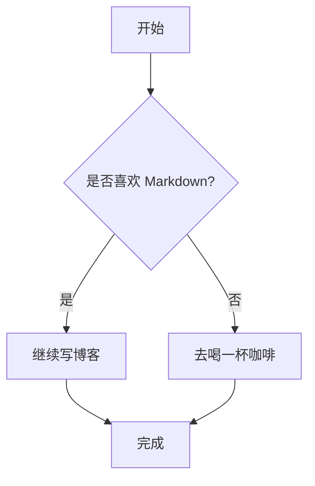

这篇文章用于测试第一阶段新增的 Markdown 扩展能力。

## 图片图注

普通图片会根据 alt 文本生成图注。

点击下面的图注图片应该可以放大浏览。


alt 以 `_` 开头时不显示图注，但图片仍然保留可访问的 alt 文本。

点击下面的隐藏图注图片也应该可以放大浏览。


## GitHub Alerts

> [!NOTE]
> 普通说明内容。这里可以包含 **加粗文本** 和 [链接](https://daybook.page)。

> [!TIP]
> 一个小技巧：保持每个功能小步实现，更容易定位问题。

> [!IMPORTANT]
> 重要信息通常用于提醒读者不要跳过关键前提。

> [!WARNING]
> 警告内容用于说明可能出现的问题。

> [!CAUTION]
> 风险提示用于强调可能带来负面结果的操作。

## Container Admonition

:::note
这是 `note` 容器提示块。
:::

:::tip
这是 `tip` 容器提示块。
:::

:::important
这是 `important` 容器提示块。
:::

:::warning
这是 `warning` 容器提示块。
:::

:::caution
这是 `caution` 容器提示块。
:::

:::note[自定义标题]
这里是带自定义标题的提示块。

- 内部列表项目
- 内部 **Markdown** 也会继续渲染
:::

## Fold

:::fold[展开查看]
这里是默认折叠的内容。

- 可以包含列表
- 可以包含代码块

```go
fmt.Println("hello fold")
```
:::

## Gallery

点击画廊中的任意图片也应该进入同一套 Lightbox，并且可以在多张图片之间左右切换。

:::gallery


:::

## Mermaid 图表

下面的 Mermaid 图表应该被渲染为流程图，而不是普通代码块。



## Leaf Embeds

::github{repo="StatIndet/daybook"}

::youtube{id="9pP0pIgP2kE"}

::bilibili{id="BV1sK4y1Z7KG"}

::spotify{url="https://open.spotify.com/track/0HYAsQwJIO6FLqpyTeD3l6"}

::spotify{url="https://open.spotify.com/album/03QiFOKDh6xMiSTkOnsmMG"}

::codepen{url="https://codepen.io/jh3y/pen/NWdNMBJ"}

::netease{type="song" id="474667755"}

::tweet{url="https://x.com/hachi_08/status/1906456524337123549"}

## 普通列表

- 普通一级列表
  - 普通二级列表
    - 普通三级列表

## 有序列表

1. 一级有序列表
   1. 二级有序列表
      1. 三级有序列表

## 嵌套任务列表

- [ ] 一级任务
  - [ ] 二级任务
    - [ ] 三级任务
- [x] 已完成任务
